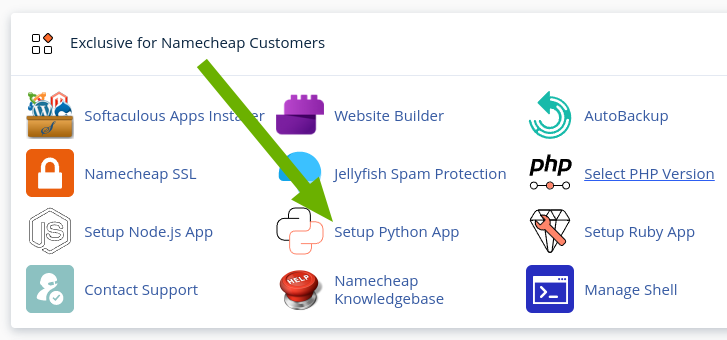
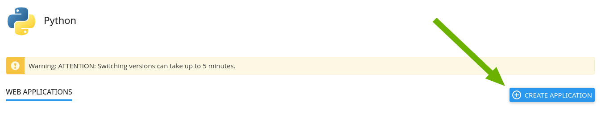
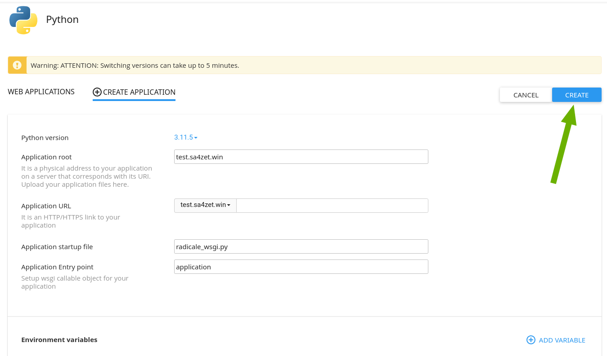
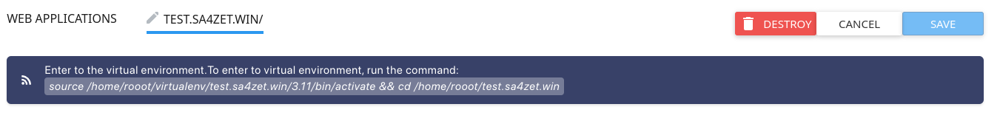
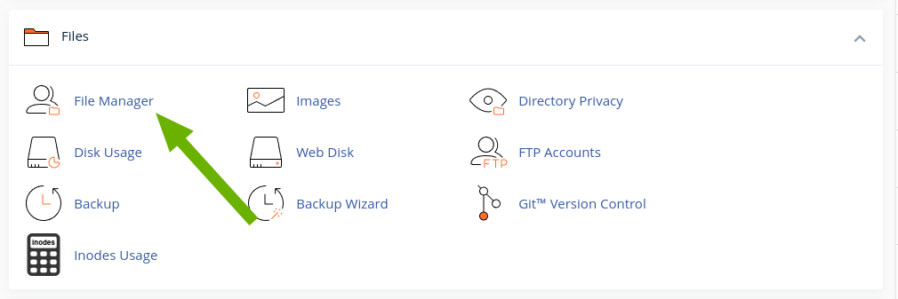
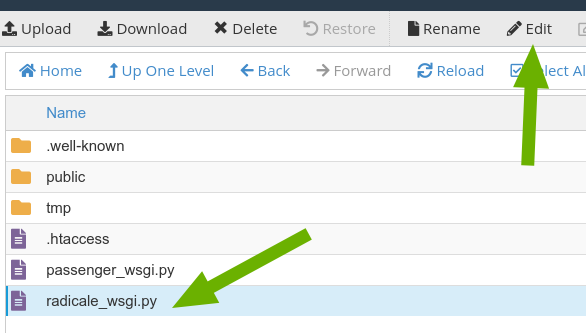
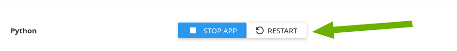

# Go to the namecheap hosting control panel.

## Create a subdomain

Don't share the document root, create a new one

[NameCheap article](https://www.namecheap.com/support/knowledgebase/article.aspx/9190/29/how-to-create-a-subdomain-in-cpanel/)

## Protect this directory with password

[NameCheap article](https://www.namecheap.com/support/knowledgebase/article.aspx/9767/29/how-to-password-protect-files-and-directories/#directories1)

## Click 'Setup Python App'



## Click 'Create Application'



# Fill the form

- Python version should greater than 3.11
- Application root is a relative path to your home directory
- Application URL is where you want to host Radicale
- Application startup file: `radicale_wsgi.py`
- Application Entry point: `application`

## Click 'Create'




## How to access a hosting account via SSH

[NameCheap article](https://www.namecheap.com/support/knowledgebase/article.aspx/1016/89/how-to-access-a-hosting-account-via-ssh/)


## Virtualenv

SSH into the host and activate the virtualenv. You can copy the activation shell command from the namecheap website.





```bash
source /home/rooot/virtualenv/test.sa4zet.win/3.11/bin/activate && cd /home/rooot/test.sa4zet.win
```

## Install Radicale

```bash
pip install radicale
```

## Run File Manager



## Edit `radicale_wsgi.py`



Customize the content below according to your configuration and save it.

```python
from radicale import Application, config

application = Application(config.load([("/%YOUR HOME%/%YOUR SUBDOMAIN%/config", False)]))
```

## Restart the python application



## DONE
